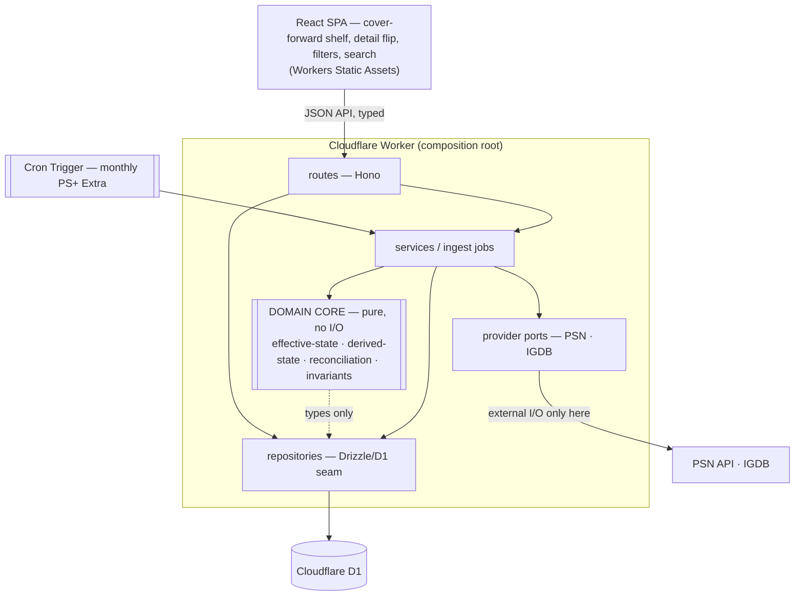
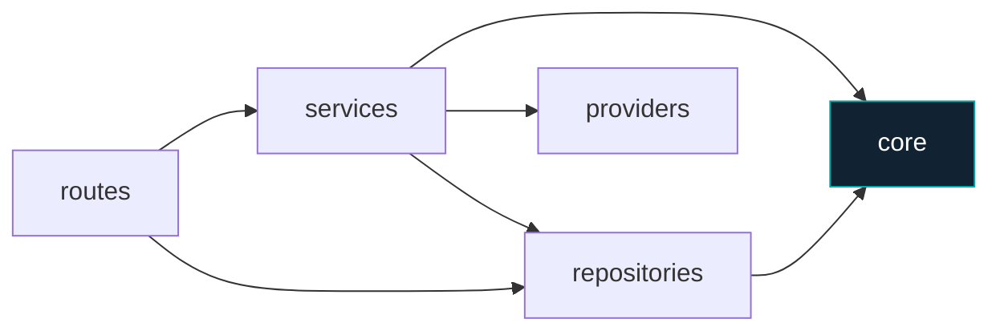
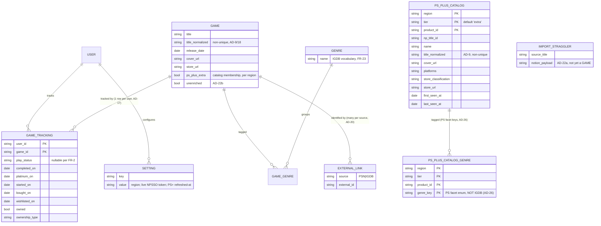
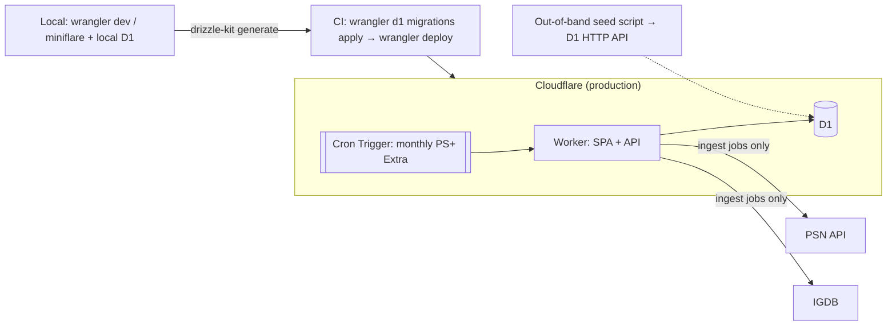

# Architecture Spine — PRESS START (PS Game Catalog)

## Design Paradigm

**Layered, with a ports-and-adapters seam at exactly two places: persistence and external providers.** Not full hexagonal — a single-user app doesn't earn that ceremony — only the two seams that carry portability (the "publish someday" door) and testability.

One Cloudflare **Worker is the composition root**: it wires adapters to a pure domain core and serves both the React SPA (Workers Static Assets) and the JSON API.



Layer map (namespaces):

```text
core/        # pure domain — imports nothing with I/O
services/    # ingest jobs + orchestration (the only place providers are touched)
repositories/# D1 access via Drizzle (persistence seam)
providers/   # PSN + IGDB adapters (external-I/O seam)
routes/      # Hono handlers + Zod validation
```

## Invariants & Rules

Dependency direction — an arrow means "may depend on"; the domain core is a sink.



### AD-1 — Platform is Cloudflare, single vendor [ADOPTED]

- **Binds:** NFR-1, NFR-2, all backend/hosting.
- **Prevents:** divergent hosting/DB/cron choices; a stateful server; an external cron pinger.
- **Rule:** One Worker serves the SPA (Static Assets) **and** the JSON API. Persistence is **Cloudflare D1**, reached via a Workers binding. Scheduled work is **Cloudflare Cron Triggers**. No second hosting vendor. Free-tier hosting is the hard constraint that outranks the SQLite preference, which outranks the Bun preference. (Free-tier subrequest budget per invocation: **50 external** + 1,000 Cloudflare-services; D1 binding calls draw on the latter — see AD-15.)

### AD-2 — Deployed runtime is workerd; Bun is dev-toolchain-only [ADOPTED]

- **Binds:** all backend; supersedes the project-context "Bun runtime" preference.
- **Prevents:** code depending on Bun-only APIs (`bun:sqlite`, Bun globals) that can't run on Workers.
- **Rule:** Production runtime is workerd/V8, TypeScript throughout. Bun is allowed only as a **local** package manager, test runner, and out-of-band script runner — never assumed at runtime. `project-context.md` is updated to reflect this.

### AD-3 — Domain core is I/O-free [ADOPTED]

- **Binds:** `core/`; all state/reconciliation logic.
- **Prevents:** an untestable domain; `fetch`/DB access leaking into business logic; two units computing the same rule differently.
- **Rule:** `core/` imports **no** `fetch` and **no** D1/Drizzle. Effective-state, derived-state, title-normalization, reconciliation, and invariant checks are pure functions, unit-tested without a network or database.

### AD-4 — Persistence only through repositories (the D1 seam) [ADOPTED]

- **Binds:** all data access; the "publish someday" migration path (FR-48).
- **Prevents:** D1 calls scattered across services; lock-in that makes a future storage move rewrite domain logic.
- **Rule:** All database access goes through `repositories/` using Drizzle. No service, route, or core module issues a raw D1 query. Storage may later migrate (D1 → Turso → Postgres) by replacing this layer alone.

### AD-5 — External I/O only through provider ports [ADOPTED]

- **Binds:** PSN + IGDB access; FR-33/34/36/38/41; the cookie→NPSSO swap.
- **Prevents:** ad-hoc `fetch` calls to third parties; auth mechanics bleeding into sync logic.
- **Rule:** Every third-party call goes through a `providers/` adapter (`PsnProvider`, `IgdbProvider`). ~~The PSN auth mechanism (the NPSSO token and the authorize→code→bearer exchange it rides through; story 9.1b, 2026-07-13 — the `pdccws_p` cookie is gone) lives **entirely inside** `PsnProvider`.~~ The **account region** (AD-23) is a `PsnProvider` input — the PS+ Extra catalog is per-region.
- **AMENDED 2026-07-15 (Epic 11, PSN Account Safety):** `PsnProvider` is narrowed to **anonymous store-browse only** (the PS+ Extra catalog fetch, which carries no account identity). The NPSSO exchange, the credentialed methods (`fetchPurchasedGames`, `fetchTrophyTitles`), and the `PsnAuthError` credentialed paths are **removed** — the app makes no credentialed PSN call. The single-flight PSN lock's `PsnOp` reduces to `catalog-refresh`. Rationale: `sprint-change-proposal-2026-07-15.md`.

### AD-6 — Nothing external on render, enforced structurally (NFR-3) [ADOPTED]

- **Binds:** all read/query paths; card render; shelf load.
- **Prevents:** a page render triggering a third-party fetch; slow, flaky, rate-limited page loads.
- **Rule:** Read/query paths use **repositories only**. A provider is touched **only** by an ingest job (seed, PS sync, PS+ check, add-by-name). A `fetch` in a query path is an architecture violation, not a judgment call. Covers and store URLs are served from persisted data.

### AD-7 — Effective-state is computed in one place (FR-8) [ADOPTED]

- **Binds:** shelf ordering, card labels, filter pills — FR-8/17/18/21.
- **Prevents:** two surfaces disagreeing on a game's state (e.g. a platinumed game matching the "Playing" pill).
- **Rule:** A single `core/` function computes effective state (`play status if set, else Platinum if platinum_on, else Story completed if completed_on`). Ordering, labels, and filters consume it; none recomputes it.

### AD-8 — Derived states are never stored; stored inputs are distinct (FR-12/13/14) [ADOPTED]

- **Binds:** Released, Wishlisted, Playable-now; and, by contrast, the stored inputs they consume.
- **Prevents:** a stored derived flag drifting out of sync with its inputs; **and** the opposite error — treating a fetched fact (cover, PS+ Extra membership) as "derived" and refusing to store it.
- **Rule:** Released, Wishlisted (= **not owned**), and Playable-now (owned-or-in-PS+Extra-catalog AND released) are **computed, never persisted** — no `wishlisted` column exists. This is disjoint from **stored inputs** — `cover_url`, `store_url`, and PS+ Extra **catalog membership** are *facts fetched from a third party*, persisted by ingest jobs (AD-6, AD-19), never user-writable; Playable-now derives *from* the stored PS+ Extra fact. "Anything that can be computed is computed" governs derivations, not fetched facts.

### AD-9 — One title-normalization function (FR-27/34/42) [ADOPTED]

- **Binds:** seed import, PS sync, add-by-name, library-match.
- **Prevents:** three normalizers producing different keys and breaking the cross-source joins.
- **Rule:** A single `core/` normalizer (strip `™`/`®` and edition suffixes, drop leading articles, case/whitespace-fold, collapse PS4/PS5 → one PS5) produces the `title_normalized` matching key, shared by every ingest and search path. It is a **non-unique candidate key** (AD-18) — the first-pass match, not the identity anchor; the `EXTERNAL_LINK` is the true identity (AD-20).

### AD-10 — Append-only to user data, at one write-path guard [ADOPTED]

- **Binds:** FR-6/9/26/33/45; every sync/import path.
- **Prevents:** any sync overwriting user-entered status, milestones, dates, or genres; membership claims polluting the owned library/wishlist.
- **Rule:** No sync/import path writes status, milestones, dates, or genres on an existing game. Sync may only **create** games and **flip `Owned` false→true** (never true→false). **Membership-sourced PS entries (PS+ claims) are filtered at the ingest boundary** — never create a game, never set `Owned`; reported as a skipped count. When entitlement source is ambiguous, **prefer skipping over flipping `Owned`.**

### AD-11 — Lifecycle & milestone dates are write-once through automatic flows (FR-44/45/6) [ADOPTED]

- **Binds:** `wishlisted_on`, `bought_on`, `started_on`, `completed_on`, `platinum_on`.
- **Prevents:** a re-sync or re-transition overwriting a recorded date; lost history that can't be reconstructed.
- **Rule:** Automatic flows write each date **once** (first value stands); no sync, status change, or replay overwrites it. `started_on` is written only while no completion milestone exists. All dates remain **manually editable in the detail view only**.

### AD-12 — The completion invariant is enforced at the boundary (FR-3) [ADOPTED]

- **Binds:** every status/milestone edit.
- **Prevents:** a game left with neither a play status nor a completion milestone.
- **Rule:** Every game always has a play status **or** at least one completion milestone. The API (and detail view) **refuse** any edit that would leave neither — clearing the last milestone requires first setting a play status. Milestone logging is confirm-gated (FR-7); milestones are immutable through normal flows.

### AD-13 — Every tracking row is user-scoped (FR-48) [ADOPTED]

- **Binds:** all user-entered tracking data; the multi-user seam.
- **Prevents:** a future publish requiring a data-model rewrite; cross-user leakage the day a second user exists.
- **Rule:** Every tracking-data row carries a `user_id`; every query filters by it — from row one. No sharing/roles/tenancy is built beyond this seam.

### AD-14 — Failures surface, never silently retry (NFR-4/FR-36/40) [ADOPTED]

- **Binds:** PS sync, PS+ refresh, external lookups.
- **Prevents:** silent data staleness; retry storms against third parties.
- **Rule:** An expired PS cookie (401/403) surfaces the refresh instructions and stops — no retry. A failed external lookup lands the game in the **stragglers** list. A failed scheduled PS+ refresh surfaces a notice on next app open. Every user-triggered long op ends in a summary; anything needing action also seeds the persistent attention banner.

### AD-15 — Heavy bulk work runs out-of-band or chunked [ADOPTED]

- **Binds:** seed import; any all-games fan-out.
- **Prevents:** blowing the free-tier **50-external-subrequests**/invocation cap (the IGDB/PSN fan-out; D1 binding calls draw on the separate 1,000-Cloudflare-services bucket, AD-1).
- **Rule:** The one-time **seed import** (enrich ~344 games) exceeds 50 external subrequests, so it runs **out-of-band as a script** (no UI — matches EXPERIENCE.md), writing D1 via the D1 HTTP API / Wrangler with the shared Drizzle schema. Steady-state incremental sync (few new games) runs in-Worker. Any future all-games fan-out that can't fit one invocation must chunk (Cloudflare Workflows/Queues) or run out-of-band.

### AD-16 — Migrations run from CI, never at deploy [ADOPTED]

- **Binds:** schema evolution; deployment.
- **Prevents:** a deploy attempting to run a Node migration script inside workerd (impossible).
- **Rule:** `drizzle-kit generate` emits versioned SQL from the TS schema; `wrangler d1 migrations apply` runs pending files from CI **before** the Worker deploy. The Worker never migrates itself at startup.

### AD-17 — `GAME_TRACKING` is keyed per user, not per game [ADOPTED]

- **Binds:** the `GAME` ↔ `GAME_TRACKING` relationship; every schema/seed/auth unit.
- **Prevents:** one dev keying tracking on `game_id` (1:1) while another keys on `(user_id, game_id)` — both "obeying" AD-13, producing incompatible schemas.
- **Rule:** `GAME_TRACKING`'s primary key is **`(user_id, game_id)`** — one tracking row per user per game (`GAME` 1:many `GAME_TRACKING`). All user-entered state (AD-13) lives here.

### AD-18 — `title_normalized` is a non-unique candidate key; external-ID is identity [ADOPTED]

- **Binds:** schema constraints; add-by-name dedupe (FR-42); sync conflict handling (FR-34).
- **Prevents:** one dev adding a `UNIQUE(title_normalized)` constraint (for FR-42) that makes FR-34's "two distinct games normalize alike" unrepresentable.
- **Rule:** `title_normalized` carries **no uniqueness constraint**. Game identity is the `EXTERNAL_LINK (source, external_id)` (AD-20). Add-by-name dedupe matches on normalized title *then* confirms against the external link; a normalized-title clash with a *different* external id is two games, not one.

### AD-19 — Attribute ownership: shared `GAME` facts vs per-user `GAME_TRACKING` state [ADOPTED]

- **Binds:** every column's home; seed, sync, and render units.
- **Prevents:** two owners of `cover_url` (seed dev puts it on shared `GAME`; sync dev, reading FR-35 "captured at sync time," puts it on per-user `GAME_TRACKING`).
- **Rule:** **`GAME`** holds shared catalog identity — `title`, `title_normalized`, `release_date`, `cover_url`, `store_url`, genres (via `GAME_GENRE`), and PS+ Extra **catalog membership** (per region, AD-23). These are stored inputs (AD-8), written by ingest jobs, not user-editable except via the detail-view genre/cover overrides. **`GAME_TRACKING`** holds per-user mutable state — `play_status`, the milestone/lifecycle dates, `owned`, `ownership_type`. `owned` is per-user (a physical disc is one user's), so it lives on `GAME_TRACKING`, not `GAME`.

### AD-20 — `EXTERNAL_LINK` is many-per-(game, source) [ADOPTED]

- **Binds:** PS4/PS5 collapse (AD-9); sync matching + conflict flagging (FR-34).
- **Prevents:** a dev modeling one external id per source, which the PS4/PS5 collapse (two PSN ids → one `GAME`) immediately violates.
- **Rule (namespace fixed 2026-07-14, Epic 7):** `source='PSN'` external ids are **`np_title_id` values only** (`CUSA…`/`PPSA…`, what `sync-reconcile` already writes). A store **`product_id` is a different source** (`'PSN_PRODUCT'`) and is never written into the `'PSN'` namespace — the unique index makes the two mutually unjoinable, so mixing them would make an add-from-catalog of an already-synced game miss on link, match on title, and (by this AD's own clash rule) create a **mandatory duplicate**. A `GAME` may hold **multiple** `EXTERNAL_LINK` rows per source (both PS4 and PS5 PSN ids resolve to the one PS5 game). Sync matches stored links first (AD-9). The FR-34 conflict is redefined: **an external id that resolves to a *different* `GAME`** than the title match — flagged in the sync summary's needs-attention list, never silently merged.

### AD-21 — The milestone-log status side-effect has one owner [ADOPTED]

- **Binds:** every surface that logs a completion milestone (shelf popover, detail view) — FR-2.
- **Prevents:** the popover path auto-clearing `play_status` to null (effective "Platinum") while the detail path leaves it "Playing" — two surfaces disagreeing though both obey AD-7's *read* rule.
- **Rule:** A single `core/` milestone-**write** reconciliation function (symmetric to AD-7's read) owns the side-effect: logging `platinum_on` auto-clears `play_status` to null per FR-2 (amended 2026-07-09 — logging `completed_on` leaves the status untouched). Every surface calls it; none hand-rolls the transition.

### AD-22 — "Straggler" is a defined needs-attention record [ADOPTED]

- **Binds:** seed import (FR-28/30), add-by-name name-only (FR-41), the attention banner.
- **Prevents:** one dev treating a straggler as an import staging row and another as a saved-but-unenriched game — two schemas behind one UI list.
- **Rule:** The stragglers list is a view over two explicit kinds: **(a) import staging rows** that couldn't be matched to a `GAME` (carry the Notion payload; *not yet* a `GAME`), and **(b) name-only add-by-name entries** (real `GAME` rows flagged `unenriched`, awaiting IGDB data). FR-30's Notion status-mapping is a pure `core/` function reusing the AD-9 normalizer; **anything it can't place → a straggler, never a guess.**

### AD-23 — PS+ Extra is per-region; region is stored [ADOPTED]

- **Binds:** PS+ Extra check (FR-38/39), manual and cron paths, Playable-now (AD-8).
- **Prevents:** the manual check and the cron check running against different regions; region living nowhere.
- **Rule:** The account **region** is persisted in the `SETTING` table (seeded from config, or derived and persisted from PSN on first sync). Both the button-triggered and cron-triggered PS+ Extra checks read it; catalog membership (AD-19) is stored per region.
- **AMENDED 2026-07-17 (Epic 8 design gate, awaiting sign-off):** region is a **per-user** SETTING row (the table is already keyed `(user_id, key)`); each user sets or derives their own. `env.PSN_REGION` is demoted to a **first-boot default for a brand-new user**, never a global fact. The set of *distinct regions across registered users* is what the per-region refresh (AD-31) fans out over.

### AD-24 — `PS_PLUS_CATALOG` is a snapshot table, never a `GAME` [Epic 7]

- **Binds:** stories 7.1/7.2/7.3; the Story 5.1 flag check.
- **Prevents:** a dev upserting catalog products into `GAME` (which would break "availability is not ownership", AD-10) or hanging `GAME_TRACKING` off a catalog row.
- **Rule:** Catalog products live in **`PS_PLUS_CATALOG`**, keyed **`(region, tier, product_id)`** with `tier` defaulting to `'extra'` (Premium's Classics catalog layers on without a migration rewrite). Its columns are **exactly what the store payload gives** — `product_id`, `np_title_id`, `name`, `title_normalized` (AD-9), `cover_url`, `platforms`, `store_classification`, `store_url` — plus `first_seen_at` / `last_seen_at`. There is **no `release_date` column**: the payload has none (see Deferred). A catalog row becomes a `GAME` **only** through the explicit add path (7.3).
- **What the 7.3 add writes** (or two devs pick differently, both legally): the new `GAME` gets `EXTERNAL_LINK('PSN_PRODUCT', product_id)` (AD-20), IGDB-enriched genres (AD-26), and **the existing add-by-name not-owned default** — `{owned: false, play_status: 'Not started', wishlisted_on: today}` (`services/games.ts` `newTracking`). It is **not owned**: browsing the catalog is not claiming, and `owned_via: 'membership'` is written only when a *sync* observes the real PS+ entitlement (FR-9 amended, Story 6.4). There is **no `ps_plus` ownership type** — `ownership_type` is `physical|digital` (the format); the *source* is `owned_via: purchase|membership`. Because the game's PS+ flag is on (AD-27), it derives as **Wishlisted + Playable-now** — precisely the pre-purchase signal ("I want this; the subscription already covers it"), not a contradiction. `store_url` from the catalog row powers "Claim now".

### AD-25 — Destinations and cross-tree intent travel through the router, never window events [Epic 7]

- **Binds:** `web/` shell, shelf, the new catalog destination (7.2), detail; supersedes the Story 6.1 event pattern.
- **Prevents:** the Epic 6 mount-race class (a listener not yet mounted swallowing an event; two live surfaces fed by one input) inheriting into a second destination — Epic 6 retro action item 2.
- **Rule:** **react-router (declarative/library mode)** owns navigation: `/` shelf, `/catalog` the catalog destination, `/game/:id` detail, `?q=` the search term. `OPEN_DETAIL_EVENT`, `SEED_SEARCH_EVENT`, and `SHELF_SEARCH_EVENT` are **deleted**, replaced by `navigate()` / `useSearchParams`. Adding a new `window` `CustomEvent` for cross-tree state is an **architecture violation, not a judgment call**. Imports come from `react-router` + `react-router/dom` (`react-router-dom` no longer exists in v8).
- **`?q=` belongs to the active destination.** The `SearchBox` is a single global component in the header, rendered above the route outlet — so one input feeding both a shelf `?q=` and a catalog `?q=` would **reintroduce the exact "two live surfaces from one input" class through the URL** instead of a CustomEvent. The header box writes **only the current route's** param, the term is **cleared on destination change**, and the "Add ⟨term⟩ to library" affordance is **shelf-only**.
- **`/game/:id` resolves through its own by-id read route** (`GET /api/games/:id`) — **never** an id lookup in the `['shelf']` list cache. Otherwise 7.3's add-then-navigate lands on the new id before the shelf query refetches and the route renders not-found: the same mount-race, now with a hard 404 on reload. A pending fetch is a **loading state**; only a *resolved* 404 is "not found".
- **Scope note (not a doc-only change):** the three events are live in `web/shelf/SearchBox.tsx`, `web/shelf/open-detail.ts`, consumed by `web/shelf/Shelf.tsx`, and asserted in `Shelf.test.tsx`, `SearchBox.test.tsx`, `SyncSummaryModal.test.tsx` — the deletion is a real refactor that rewrites those suites. It lands in 7.2, which owns the second destination.
- **Already satisfied:** `wrangler.jsonc` sets `assets.not_found_handling: "single-page-application"` (root + `e2e` env) and carves `/api/*` out via `run_worker_first`, so deep links survive reload and `/api/*` still reaches the Worker. **Keep both** — a router change must not touch that carve-out.

### AD-26 — Two genre vocabularies, never merged [Epic 7]

- **Binds:** the catalog genre filter (7.2) vs. the shelf genre filter (FR-23); the 7.3 add path.
- **Prevents:** PS facet keys being written into `GENRE`/`GAME_GENRE` (IGDB vocabulary, AD-19), so the shelf's genre pills silently grow a `ROLE_PLAYING_GAMES` next to `Role-playing (RPG)`.
- **Rule:** PS-store genres are the `productGenres` **facet keys** (`ACTION`, `ADVENTURE`, `ROLE_PLAYING_GAMES`, …), stored in **`PS_PLUS_CATALOG_GENRE`** — catalog-local, region+tier-scoped.
- **The key list is DISCOVERED per region at ingest, never hardcoded.** Probed 2026-07-14: `de-de` returns **19** keys, `en-us` returns **20** (it adds `MUSIC/RHYTHM`). A pinned 19-key enum would silently drop an entire genre for any region that has one we didn't see — the Story 9.3 `npServiceName` failure exactly (a constant asserted from one sample, wrong across the population). Read the facet list from the unfiltered response each run and sweep whatever it names. Keys are **not** identifier-safe: `MUSIC/RHYTHM` contains a slash and filters correctly only as a URL-encoded `filterBy: ["productGenres:MUSIC/RHYTHM"]` variable — never interpolate a key into a path or an unencoded query. `GENRE`/`GAME_GENRE` stays **IGDB-only**. Localized display names are rendered, never stored. On add (7.3), the new `GAME`'s genres come from **IGDB enrichment**, not from the catalog facet.

### AD-27 — One catalog fetch feeds both the snapshot and the flag check [Epic 7]

- **Binds:** `runPsPlusCheck` (`services/psplus.ts`), the cron path (5.2), story 7.1.
- **Prevents:** two fetch paths — one to persist the catalog, one to flag tracked games — drifting to different regions, pages, or guards (the both-directions bug class AD-23 exists for).
- **Rule:** The ingest fetches **once**, upserts + prunes `PS_PLUS_CATALOG`, and the tracked-game `ps_plus_extra` flag pass (AD-19/23) then reads **the table**, not a second fetch. The **empty-catalog wipe guard** (a 200 with zero products = provider failure — the guard inside `runPsPlusCheck`) runs **before any prune or clear**; it now guards two datasets, so it stays a hard abort.
- **`PS_PLUS_CATALOG` is the single source of truth for membership.** `game.ps_plus_extra` is a **denormalized cache** of it, maintained for **every** tracked game with a normalized-title match — **owned games included**. (Today's flag pass writes only tracked *non-owned* rows, so an owned catalog game is `true` in the table and `false` on the flag: the shelf pill and the catalog grid would give opposite answers, both "correct". Story 7.1 fixes the flag pass.) Every membership read — shelf pill, Playable-now, the catalog grid's in-library marker — goes through **one `core/` function**, never a hand-rolled join.

### AD-28 — The genre sweep is a separate, chunked, additive pass [Epic 7]

- **Binds:** the 7.1 ingest.
- **Prevents:** the genre sweep being coupled into the membership pass, so one flaky genre query takes down the whole snapshot — and an unbounded page count (the sweep grows with the catalog and the facet list, both outside our control) silently walking into AD-15's 50-external-subrequest cap.
- **Rule:** Per-game genre is **not in the product record** — it is only obtainable by re-querying the category once per genre facet key (`filterBy: ["productGenres:HORROR"]`). So the **membership pass** (products) and the **genre-tagging sweep** are separate chunked passes with a resumable cursor (the Story 9.3 backfill pattern). Genre tags are **additive**; a failed genre pass leaves the snapshot valid but partially tagged — it never blocks or invalidates the membership snapshot.
- **Generation-stamped, or the sweep corrupts the snapshot:** each membership pass stamps a **snapshot generation** on the rows it writes; the sweep **carries that generation**, tags only rows belonging to it, and a generation change (a cron prune landing mid-sweep) **invalidates the cursor** rather than resuming into a re-ordered product list and silently skipping a band of games. `PS_PLUS_CATALOG_GENRE` rows **cascade-delete** with their pruned product, so a prune can never leave orphan genre tags.
- **Today's arithmetic does *not* trip the cap** (~490 products ≈ 5 base pages + ~25 genre pages + the bearer exchange ≈ 30 of 50): the decoupling is bought for partial-failure isolation and headroom, **not** because the sweep overflows today. Do not "optimize" it back into one pass on the grounds that 30 < 50.
- **AMENDED 2026-07-17 (Epic 8 gate):** the bearer exchange is gone (Epic 11 — the fetch is anonymous). Shipped accounting (`psplus.ts` Epic-7 H3 guard): the **membership pass alone ≈ 34 subrequests**, a **genre-sweep chunk ≈ 25+**, the leaving-sweep chunks run ≤ ~42 — the passes are **never combined in one invocation** and each cron fire consumes **one rotation slot**. The decoupled slot model **stands unchanged** under the per-region refresh; AD-31/AD-32 budget regions in rotation slots, not single-invocation regions.

### AD-29 — Admission is a stored allowlist, enforced at every door [PROPOSED 2026-07-17 — Epic 8 gate, awaiting sign-off]

- **Binds:** stories 8.2+; supersedes `env.AUTH_ALLOWED_EMAIL` as the admission source. Consumed by 8.2.
- **Prevents:** an admission rule that gates user *creation* while better-auth's account-LINK path admits by email match; a de-admitted user keeping a live session; strangers growing the `verification` table unmetered.
- **Rule:** Admission is **invite-shaped, not open registration**: an `ADMISSION` allowlist table in D1 (email rows, owner-managed from settings), replacing the single-email env check. An empty list admits **nobody** (fail closed, today's posture). ONE admission function is enforced at **all five doors**: (1) the magic-link pre-gate, (2) the OAuth `user.create.before` hook, (3) the OAuth account-**LINK** path (`accountLinking` gated by the same rule — better-auth links by email without the create hook), (4) `requireAuth` **and** `/api/auth/get-session` (the SPA's gate), so de-admission lands on the login screen, not a 401-ing shell, (5) the `sendMagicLink` defense-in-depth check — all five call the one function. Emails are stored **lowercased** and compared case-insensitively (today's `isAllowedEmail` rule). **De-admission revokes the user's `session` rows** but deletes no data: `user` and tracking rows are retained, and a re-admitted user finds their library intact; de-admitted users' regions **stop counting** toward AD-31's fan-out immediately.
- **Bootstrap and lockout guards:** the 8.2 migration **seeds the table from `AUTH_ALLOWED_EMAIL`** in the same migration that switches the check — the table is never empty on the deploy that makes it authoritative. The seeded row is the **owner row**: the settings editor **refuses self-removal and refuses removing the last row** (no fail-closed suicide); removing the owner row requires a migration, not a click. Any admitted user may manage the list (no roles — the guard, not a role, prevents lockout).
- **Rate limiting is edge-first, never D1-metered:** limits ride **Cloudflare WAF rate-limiting rules** on `/api/auth/*` (free tier includes one rule) — never D1 counter rows, which would hand an attacker a write per anonymous hit against the 100k/day budget (AD-32). The `verification`-row residue rate limiting only slows gets a **TTL sweep**: expired rows (better-auth stamps `expiresAt`) are deleted by the existing cron. No roles, no sharing, no tenancy beyond AD-13's seam. *(Registration-vs-invite was the gate's open product call; invite is the proposal — free-tier budgets and no moderation surface make open signup an unfunded liability. Luca's sign-off decides.)*

### AD-30 — PS+ facts are per-region data; per-user answers are derivations [PROPOSED 2026-07-17 — Epic 8 gate, awaiting sign-off]

- **Binds:** `game.ps_plus_extra`, `ps_plus_left_on`, `ps_plus_leaving_on`, `psn_concept_id`; the three flag writers; stories 8.3/8.4. Consumed by 8.3.
- **Prevents:** user B's region check repainting user A's catalog pills (the B2 write-collision); per-user snapshot copies burning the 100k/day write budget (~100 users/day ceiling).
- **Rule:** The four PS+ columns on shared `GAME` are **region-scoped facts in the wrong home**, and they split by lifecycle: **membership** (`ps_plus_extra`) derives from `PS_PLUS_CATALOG` itself — extending AD-27: the table is sole truth, and the cache column becomes a **derivation**: *user's region (AD-23) joined against region-scoped data, through the existing single `core/` membership function*. **The departure facts (`ps_plus_left_on`, `ps_plus_leaving_on`, `psn_concept_id`) cannot live in the snapshot** — a departed game is precisely the one whose snapshot row the prune deleted (AD-28 cascade). They move to a **mandatory region-keyed departure ledger**, keyed **`(region, product_id)`** (carrying `np_title_id`/normalized title for the library join), written by the leaving/left sweeps and **surviving every prune**; the 8.3 migration copies today's `game`-column values into the existing user's region rows losslessly. **Never a per-user copy of catalog rows.** Writer map (all three shipped): the **check** and the **cron** write the per-region snapshot + departure ledger; the **cancel-PS+ un-claim** (Story 6.4, `POST /settings/cancel-ps-plus` — shipped, not future) mutates only per-user `GAME_TRACKING` (`owned`/`owned_via`) and, post-8.3, touches **no shared flag** — the "per-user shape" it writes *is* the tracking row; the per-user membership answer re-derives. `critic_score`/`user_score`/`ttb_*` are region-independent shared facts and **stay on `GAME`**.

### AD-31 — The scheduled refresh is per-region, with a region-state ledger [PROPOSED 2026-07-17 — Epic 8 gate, awaiting sign-off]

- **Binds:** `runScheduledPsPlusCheck`, the cron trigger, story 8.4. Consumed by 8.4.
- **Prevents:** a cron that loops N users (N fetches of the same catalog, N snapshot writes — the write cliff); silent regional starvation when a refresh fails; failure banners users can't act on.
- **Rule:** The cron fans out over the **distinct regions of admitted users** (AD-29; de-admitted users don't count) — one **anonymous** fetch, one shared snapshot per region. *(External surface: the public PS+ catalog endpoint, no account identity, no credential on the wire — the credentialed path died with Epic 11.)* A **region-state ledger** row per region — `last_success`, `last_attempt`, `failure_count`, cycle-complete, **`last_user_activity`** — drives each fire under AD-28's rotation-slot model (one slot per fire, a full region cycle ≈ 7–8 slots, AD-32). Ordering: **failed/stale regions first**, with a **quarantine guard**: after **3 consecutive failures** a region drops to **one attempt per cycle** at the back of the rotation (the shipped 2-attempt leaving-sweep livelock guard's shape) — a poison region can never starve the rotation it sorts ahead of.
- **Activity, not sign-ins:** `last_user_activity` is touched by any authenticated request of an admitted user in that region (at most one ledger write per region per day). **Skip** a region idle **60 days by that measure**, or already cycle-complete. The **stale-snapshot guard** (> **35 days**) fires on session establishment, on a **region-setting change** (to a region with a missing/stale snapshot), and on the **first authenticated request of a day** — long-lived sessions and mid-session region moves both reach it; a user with no region setting gets the first-boot default (AD-23) and is never region-less. The guard triggers a `waitUntil` **membership pass only** (≈34 subrequests fit beside a request; AD-28 forbids bundling sweeps), under a **region-keyed single-flight lock** (the `withPsnLock` pattern re-keyed region-wide — concurrent same-region sign-ins or a sign-in landing mid-cron coalesce to one refresh); genre tags and departure data follow via the cron, where the revived region sorts first. The UI shows "PS+ catalog updating…" beside the as-of timestamp.
- **Cycle-complete** (the definition `epics.md` defers here): membership pass **and** full genre sweep **and** leaving sweep all succeeded within the current **rotation window** (the `15-28` cron window of the calendar month); the flag resets when a new window opens. Sweep cursors and leaving-state move from per-user `SETTING` rows to the **region ledger** — a userless per-region cron cannot key state by user. Ledger rows are permanent (tiny); a region's **snapshot + genre + departure rows are pruned after a full idle cycle** (60-day skip that lasted the whole window), rebuilt by the revival guard if the region returns.
- **Refresh failures are passive** (structured logs + staleness via the as-of date — no attention banners; amends AD-14's banner rule for this path: users have no action to take). **Story 8.4 owns retiring the banner machinery** — `psplus_refresh_failed` / `markPsPlusRefreshFailed` and the banner surface go with the manual button. In multi-user, the **manual check button is removed** — snapshot writes come only from the cron and the sign-in guard.

### AD-32 — Free-tier budgets are enumerated arithmetic, not intents [PROPOSED 2026-07-17 — Epic 8 gate, awaiting sign-off]

- **Binds:** every cron fan-out and read path; stories 8.4/8.6; extends AD-15. Consumed by 8.4 and 8.6.
- **Prevents:** a budget that counts the fetches it's thinking about and ignores D1 binding calls or middleware reads (the Epic 9 bug, twice).
- **Rule:** The binding limits (capacity research 2026-07-17): **50 external subrequests/invocation**, **5M D1 rows read/day**, **100k rows written/day** (indexed writes bill ~double; D1 bills rows *scanned*, not returned) — and the scarcest budget of all, **cron fires: ~28/month** (`0 9,21 15-28 * *`).
- **Per-region rotation arithmetic** (shipped H3 accounting, AD-28 amendment): membership pass ≈ **34** subrequests, genre sweep ≈ **5 chunks** of ~25+, leaving sweep ≈ 1–2 chunks of ≤~42 — a full region cycle ≈ **7–8 rotation slots**, one slot per fire. **~28 fires/month ÷ ~8 slots ≈ a 3–4-region ceiling per month at the current cadence.** That is the real region cap and it is fine at launch scale (one region today; a handful of invitees share few regions); when the distinct-region count approaches it, the remedy is **denser fires inside the 15–28 window** (cron budget: 5 triggers free) or splitting slots across two triggers — named here so 8.4 states its plan against this number, not discovers it.
- **Write arithmetic:** a full ~490-row snapshot write ≈ **~1,000 row-writes** → regions × ~1,000/**month** ≪ 100k/**day**, vs the rejected per-user model ≈ 1,000/user/**day** = a ~100-user hard cliff. Writes are **not** the binding constraint per-region — reads are (which is why AD-33 §5 rejects the diff-upsert micro-optimization).
- **Per request:** a whole-library scan ≈ **~1,500 rows** (shelf, and today's game-by-id) + the session read + the two reads *this gate adds* — the AD-29 admission check and the AD-33 library-version/ETag read (a version bump also costs +1–2 indexed writes per tracking edit). Research's session model: an active session ≈ **~9,000 rows** → 5M ÷ 9,000 ≈ **~550 DAU** pre-8.6 (the oft-quoted ~3,300/day is a *single-endpoint* max, not a DAU figure). 8.6's enumerated fixes lift the read ceiling to ≈ **~2,000 DAU** (research); the **~6,600** figure is the change proposal's *request-cap* ceiling — reachable only once reads stop binding (ETag/cache multipliers, unquantified). Any new fan-out or scan states its arithmetic against these numbers before merging.

### AD-33 — Catalog delivery is paged and version-keyed; unchanged reads answer 304 [PROPOSED 2026-07-17 — Epic 8 gate, awaiting sign-off]

- **Binds:** the shelf/catalog read routes, story 8.6's read-budget work. Consumed by 8.6 (and 8.4's snapshot writes).
- **Prevents:** every shelf refetch re-scanning the whole library; the catalog route hauling 490 rows per page view; snapshot refreshes rewriting unchanged rows.
- **Rule:** (1) **Single-row reads for single rows** — `GET /games/:id` reads `WHERE id = ?`, never load-library-and-find; counts use SQL `COUNT(*)`. (2) **Catalog delivery to the FE is paged** (the existing cursor), never whole-snapshot. (3) **Per-active-region catalog cache, version-keyed on the snapshot generation** (AD-28's stamp) — every completed refresh rotates the generation (full write, AD-28), so the cache key rotates with it, including a zero-change refresh. (4) **Per-user library version for ETag/304** — an unchanged shelf refetch answers 304, not a re-scan. The invariant, not just the mechanism: **every repository write path that mutates a user's tracking or library bumps that user's version** — 8.6 enumerates the writer list (status, milestones, dates, ownership, add/discard/revive, un-claim, the 8.5 backfill) and a missed bump is a correctness bug (a stale 304 never self-heals). (5) **Diff-based snapshot upserts are REJECTED** — deliberately overriding the change proposal here: a diff write leaves unchanged rows on an old generation, which silently breaks AD-28's generation-carried sweep and prune (the "skipped band of games" failure it exists to prevent), to save ~1,000 row-writes/region/*month* against a 100k/*day* budget (AD-32) — integrity bought back for ~1% of a day's writes. (6) Optional: better-auth `session.cookieCache` — if enabled, its TTL **bounds de-admission latency** (a revoked session stays live until expiry, AD-29), so the TTL is capped at **≤ 5 minutes** or the option stays off. Single-tenant-safe; 8.6 may land any of it before 8.2.

## Consistency Conventions

| Concern | Convention |
| --- | --- |
| Language / modules | TypeScript throughout; layer namespaces `core/ services/ repositories/ providers/ routes/` (AD paradigm). Core is a dependency sink. |
| API contract | Hono routes; **Zod** schema at every boundary, shared SPA↔Worker; typed RPC client. |
| Entities & keys | `snake_case` DB columns; normalized title (AD-9) is the cross-source match key; a permanent external-ID/alias link (FR-29) survives re-sync. |
| Dates | Milestones & lifecycle dates are `DATE`/ISO-8601; write-once automatic, edit-only-in-detail (AD-11). Derived "Released" compares release date ≤ today (AD-8). |
| State | Play status is the only user-set mutable state; everything else is computed (AD-7/8) or write-once (AD-10/11). |
| Auth | better-auth magic link (FR-47); every tracking query is `user_id`-scoped (AD-13). |
| Navigation | react-router owns destinations and cross-tree intent (AD-25); URL is the state. **No `window` `CustomEvent` for cross-tree state.** |
| Genre vocabularies | IGDB genres → `GENRE`/`GAME_GENRE` (the shelf). PS facet keys → `PS_PLUS_CATALOG_GENRE` (the catalog). Never merged (AD-26). |
| Secrets | IGDB/Twitch creds + a seed `PSN_NPSSO` via Wrangler secrets; the **live** NPSSO token lives in a D1 settings table (`psn_npsso`), editable in-UI, read fresh per call. D1 file and secrets never committed. |
| Errors / feedback | Failures surface (AD-14); four UI channels (toast / summary modal / attention banner / loading) per EXPERIENCE.md; providers never silent-retry. |
| Testing | Vitest via `@cloudflare/vitest-pool-workers` for Worker+D1; pure core unit-tested without runtime. Lint+format = Biome. |

## Stack

| Name | Version / pin |
| --- | --- |
| Runtime | Cloudflare Workers (workerd), TypeScript |
| Hosting | One Worker + Workers Static Assets (SPA) |
| Database | Cloudflare D1 (SQLite) |
| ORM / migrations | Drizzle ORM 0.45.x + drizzle-kit |
| API router | Hono (+ typed RPC client) |
| Validation | Zod |
| Client server-state | TanStack Query |
| UI / build / PWA | React 19.2 + Vite 8 + vite-plugin-pwa |
| Routing | **react-router 8.2.x** — to add in 7.2, not yet a dependency. Declarative/library mode (no Vite plugin, so no Vite floor). ESM-only; peer React ≥19.2.7 (repo: 19.2.7 ✓); `engines.node ≥22.22` is metadata only — CI and the build run **Bun 1.3.14**, no Node. Import from `react-router` / `react-router/dom` (`react-router-dom` is gone in v8). AD-25 |
| Scheduling | Cloudflare Cron Triggers |
| Auth | better-auth (magic link) |
| PS data | NPSSO token → bearer exchange, then persisted GraphQL (`getPurchasedGameList`); swap landed in story 9.1b (2026-07-13) |
| Games DB | IGDB (Twitch OAuth2 client-credentials) |
| Tests | Vitest + `@cloudflare/vitest-pool-workers` |
| Lint + format | Biome v2 |
| Legacy (frozen) | Python 3.11 bootstrap scripts — seed only, no new code |

## Structural Seed

Core entities (names + relationships only; attribute-level rules are ADs, not this diagram):



Attribute ownership is an invariant (AD-19): `GAME` = shared catalog facts (stored inputs); `GAME_TRACKING` = per-user mutable state. `PS_PLUS_CATALOG` is a **third** owner class — a fetched store snapshot that is neither (AD-24): no `user_id`, no tracking, no link to `GAME` except the AD-9 normalized title used to mark "already in my library" at render.

Deployment & environments:



**Delivery & operations:**

- **Trunk-based development:** `main` is the trunk; short-lived branches merged fast. No release branches or tags in v1 — GitFlow ceremony earns nothing at single-user scale; deferred to the publish milestone (a Wrangler `staging` environment + tags is a later config change, not a rework).
- **CI on every push/PR:** Biome (lint+format) + Vitest (workers pool) + `tsc`.
- **CD on merge to `main`:** `wrangler d1 migrations apply` → `wrangler deploy` (AD-16 order). Optional manual-approval gate on the production step guards *destructive* migrations — the one real footgun for a DB-backed app.
- **Observability:** structured logs over ingest jobs + cron runs, inspected via `wrangler tail`; a failed cron run surfaces in-app on next open (AD-14/FR-40).
- **Backup/DR:** D1 **Time Travel** (point-in-time recovery) is the primary safety net; the FR-49 **CSV export** is the user-held second copy — the DB provider's backups are deliberately not the only copy.

Source tree (scaffold, not a mirror):

```text
ps-game-catalog/
  src/
    core/          # pure domain (AD-3): effective/derived state, normalize, reconcile
    services/      # ingest jobs: seed, sync, ps-plus-check, add-by-name
    repositories/  # Drizzle/D1 access (AD-4)
    providers/     # psn/, igdb/ adapters (AD-5)
    routes/        # Hono handlers + Zod (API)
    schema/        # Drizzle schema + zod contracts (shared)
  web/             # React SPA (Vite) — shelf, detail, filters, search
  migrations/      # drizzle-kit SQL (applied in CI, AD-16)
  scripts/         # out-of-band seed (AD-15); legacy Python (frozen)
  wrangler.toml    # Worker + D1 binding + cron
```

## Capability → Architecture Map

| Capability / Area | Lives in | Governed by |
| --- | --- | --- |
| The Shelf, cards, filters, search (§3) | `web/` + read routes | AD-6, AD-7, AD-8 |
| State model & effective/derived state (§2) | `core/` | AD-3, AD-7, AD-8, AD-11, AD-12 |
| Seed import (§4.1) | `scripts/` (out-of-band) + `services/` | AD-9, AD-10, AD-15, AD-18, AD-20, AD-22 |
| PS library sync (§4.2) | `services/` + `providers/psn` | AD-5, AD-9, AD-10, AD-14, AD-20 |
| PS+ Extra check (§4.3) | `services/` + Cron Trigger | AD-1, AD-5, AD-14, AD-19, AD-23, AD-27 |
| PS+ catalog snapshot + genre sweep (7.1) | `services/psplus` + `providers/psn` + `repositories/` | AD-24, AD-26, AD-27, AD-28, AD-15 |
| Catalog destination — browse/filter/search (7.2) | `web/catalog/` + read routes | AD-6, AD-25, AD-26 |
| Add or claim from the catalog (7.3) | `services/` + `providers/igdb` | AD-10, AD-18, AD-24, AD-26 |
| Navigation & cross-tree intent | `web/` router | AD-25 |
| Add-by-name (§4.4) | `services/` + `providers/igdb` | AD-5, AD-9, AD-14, AD-18, AD-22 |
| Stragglers (§4.1/4.4) | `services/` + attention banner | AD-22 |
| State model & milestone writes (§2) | `core/` | AD-7, AD-11, AD-12, AD-21 |
| Game vs tracking schema | `schema/`, `repositories/` | AD-17, AD-18, AD-19, AD-20 |
| Lifecycle dates (§4.5) | `core/` + `repositories/` | AD-11 |
| Auth & user seam (§5) | better-auth + `repositories/` | AD-13 |
| Persistence / migrations | `repositories/`, `migrations/` | AD-4, AD-16 |
| CSV export (FR-49) | `routes/` streaming from D1 | AD-4, AD-6 |

## Deferred

- **Spike S-1 — PSN auth surface** — ✓ **RESOLVED 2026-07-13** (Epic 9 story 9.1; endpoint × auth-path table in `implementation-artifacts/deferred-work.md` DW-10). Probed the wishlist, `getPurchasedGameList`, and trophy endpoints under both `pdccws_p` and an NPSSO bearer. Findings: **trophies require NPSSO** (cookie → 401); the bearer *also* serves `getPurchasedGameList`, so it replaces rather than complements the cookie; the wishlist is the Apollo persisted query `storeRetrieveWishlist` whose hash isn't client-computable (freeform GraphQL refused). Closes PRD open-q #2. The cookie→NPSSO swap is no longer "revisit when friction bites" — it is **scheduled as Epic 9 story 9.1b** (still a `PsnProvider` internal per AD-5), gating trophy sync; wishlist reachability is deferred to story 9.1c (hash capture).
- **Critic & user scores — IGDB** (PRD open-q #5, RESOLVED 2026-07-13). `aggregated_rating` (critic) and `rating` (user) come from the same `/games` endpoint the `IgdbProvider` already calls — **no second adapter**. Scored fields + a scheduled refresh only. Fallback if coverage is thin on real titles: OpenCritic. RAWG is out.
- **Sale detection** (PRD addendum) — a future daily Cron Trigger over wishlisted titles; prerequisite is capturing PS Store product IDs, which the v1 "View on PS Store" link (FR-16) already starts collecting.
- **Trophy sync, critic/user scores, "leaving PS+ soon", Google OAuth (→ Epic 8/B1a)** — v1.x (PRD §6); no v1 structure beyond the provider seam and `user_id` scoping.
- **Multi-tenant hardening** (roles, sharing, per-user rate isolation, D1-per-tenant) — only if publish happens; AD-13 keeps the door open, nothing more built. **AMENDED 2026-07-17 (Epic 8 gate):** the door now has a named admission model (AD-29) and a per-region data/refresh design (AD-30..33) awaiting sign-off — still no roles, no sharing, no per-tenant D1.
- **Release management** (release branches, tagged production releases, a Wrangler `staging` environment) — deferred to the publish milestone; v1 is trunk-based with CD from `main`. A later config change, not a rework.
- **Convex / Postgres migration** — not needed at single-user free-tier scale; AD-4 makes it a repository-layer change if ever required.
- **Catalog `release_date`** (Epic 7 story 7.1 AC) — **not obtainable.** The live `categoryGridRetrieve` payload (probed 2026-07-14, `de-de`, 490 products) exposes `productReleaseDate` only as a *sort key and facet*, never as a product field; a per-product fetch would cost ~490 external subrequests and violates AD-15. **Story 7.1's AC must drop the release-date column** — the architecture will not carry a field the source can't fill. If a release date is ever wanted on a catalog card, it comes from IGDB *after* add (7.3), where the game is a `GAME` and already enriched.
- **PS+ Premium (Classics) tier** — the `tier` column (AD-24) and the region+tier key exist from row one; the Premium category id and a tier filter are a later epic's config + UI change, not a migration.
