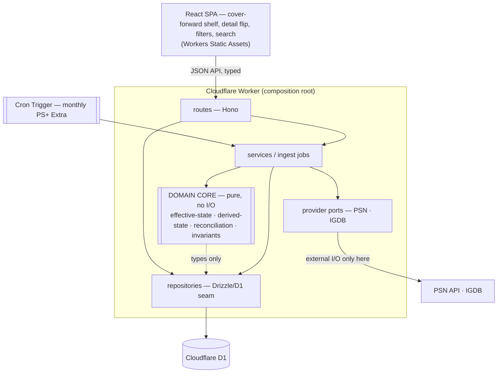
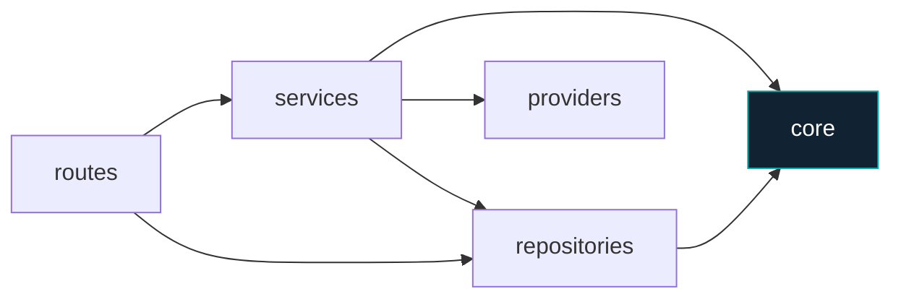
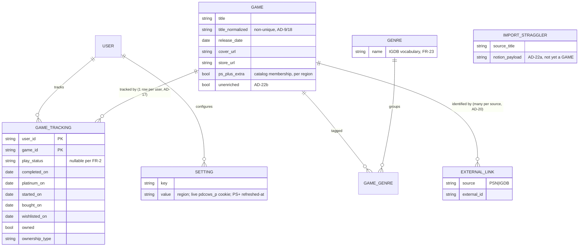
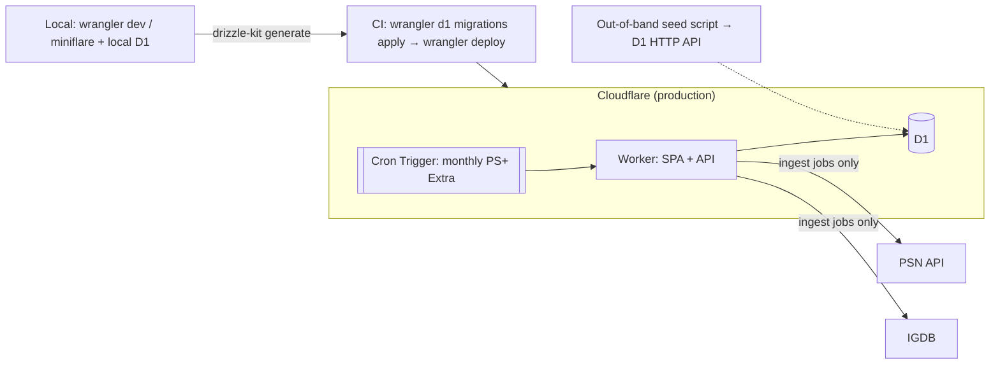

# Architecture Spine — PRESS START (PS Game Catalog)

## Design Paradigm

**Layered, with a ports-and-adapters seam at exactly two places: persistence and external providers.** Not full hexagonal — a single-user app doesn't earn that ceremony — only the two seams that carry portability (the "publish someday" door) and testability.

One Cloudflare **Worker is the composition root**: it wires adapters to a pure domain core and serves both the React SPA (Workers Static Assets) and the JSON API.



Layer map (namespaces):

```text
core/        # pure domain — imports nothing with I/O
services/    # ingest jobs + orchestration (the only place providers are touched)
repositories/# D1 access via Drizzle (persistence seam)
providers/   # PSN + IGDB adapters (external-I/O seam)
routes/      # Hono handlers + Zod validation
```

## Invariants & Rules

Dependency direction — an arrow means "may depend on"; the domain core is a sink.



### AD-1 — Platform is Cloudflare, single vendor [ADOPTED]

- **Binds:** NFR-1, NFR-2, all backend/hosting.
- **Prevents:** divergent hosting/DB/cron choices; a stateful server; an external cron pinger.
- **Rule:** One Worker serves the SPA (Static Assets) **and** the JSON API. Persistence is **Cloudflare D1**, reached via a Workers binding. Scheduled work is **Cloudflare Cron Triggers**. No second hosting vendor. Free-tier hosting is the hard constraint that outranks the SQLite preference, which outranks the Bun preference. (Free-tier subrequest budget per invocation: **50 external** + 1,000 Cloudflare-services; D1 binding calls draw on the latter — see AD-15.)

### AD-2 — Deployed runtime is workerd; Bun is dev-toolchain-only [ADOPTED]

- **Binds:** all backend; supersedes the project-context "Bun runtime" preference.
- **Prevents:** code depending on Bun-only APIs (`bun:sqlite`, Bun globals) that can't run on Workers.
- **Rule:** Production runtime is workerd/V8, TypeScript throughout. Bun is allowed only as a **local** package manager, test runner, and out-of-band script runner — never assumed at runtime. `project-context.md` is updated to reflect this.

### AD-3 — Domain core is I/O-free [ADOPTED]

- **Binds:** `core/`; all state/reconciliation logic.
- **Prevents:** an untestable domain; `fetch`/DB access leaking into business logic; two units computing the same rule differently.
- **Rule:** `core/` imports **no** `fetch` and **no** D1/Drizzle. Effective-state, derived-state, title-normalization, reconciliation, and invariant checks are pure functions, unit-tested without a network or database.

### AD-4 — Persistence only through repositories (the D1 seam) [ADOPTED]

- **Binds:** all data access; the "publish someday" migration path (FR-48).
- **Prevents:** D1 calls scattered across services; lock-in that makes a future storage move rewrite domain logic.
- **Rule:** All database access goes through `repositories/` using Drizzle. No service, route, or core module issues a raw D1 query. Storage may later migrate (D1 → Turso → Postgres) by replacing this layer alone.

### AD-5 — External I/O only through provider ports [ADOPTED]

- **Binds:** PSN + IGDB access; FR-33/34/36/38/41; the cookie→NPSSO swap.
- **Prevents:** ad-hoc `fetch` calls to third parties; auth mechanics bleeding into sync logic.
- **Rule:** Every third-party call goes through a `providers/` adapter (`PsnProvider`, `IgdbProvider`). The PSN auth mechanism (v1: `pdccws_p` cookie) lives **entirely inside** `PsnProvider`; swapping to NPSSO changes only that adapter. The **account region** (AD-23) is a `PsnProvider` input — the PS+ Extra catalog is per-region.

### AD-6 — Nothing external on render, enforced structurally (NFR-3) [ADOPTED]

- **Binds:** all read/query paths; card render; shelf load.
- **Prevents:** a page render triggering a third-party fetch; slow, flaky, rate-limited page loads.
- **Rule:** Read/query paths use **repositories only**. A provider is touched **only** by an ingest job (seed, PS sync, PS+ check, add-by-name). A `fetch` in a query path is an architecture violation, not a judgment call. Covers and store URLs are served from persisted data.

### AD-7 — Effective-state is computed in one place (FR-8) [ADOPTED]

- **Binds:** shelf ordering, card labels, filter pills — FR-8/17/18/21.
- **Prevents:** two surfaces disagreeing on a game's state (e.g. a platinumed game matching the "Playing" pill).
- **Rule:** A single `core/` function computes effective state (`play status if set, else Platinum if platinum_on, else Story completed if completed_on`). Ordering, labels, and filters consume it; none recomputes it.

### AD-8 — Derived states are never stored; stored inputs are distinct (FR-12/13/14) [ADOPTED]

- **Binds:** Released, Wishlisted, Playable-now; and, by contrast, the stored inputs they consume.
- **Prevents:** a stored derived flag drifting out of sync with its inputs; **and** the opposite error — treating a fetched fact (cover, PS+ Extra membership) as "derived" and refusing to store it.
- **Rule:** Released, Wishlisted (= not owned), and Playable-now (owned-or-in-PS+Extra-catalog AND released) are **computed, never persisted** — no `wishlisted` column exists. This is disjoint from **stored inputs** — `cover_url`, `store_url`, and PS+ Extra **catalog membership** are *facts fetched from a third party*, persisted by ingest jobs (AD-6, AD-19), never user-writable; Playable-now derives *from* the stored PS+ Extra fact. "Anything that can be computed is computed" governs derivations, not fetched facts.

### AD-9 — One title-normalization function (FR-27/34/42) [ADOPTED]

- **Binds:** seed import, PS sync, add-by-name, library-match.
- **Prevents:** three normalizers producing different keys and breaking the cross-source joins.
- **Rule:** A single `core/` normalizer (strip `™`/`®` and edition suffixes, drop leading articles, case/whitespace-fold, collapse PS4/PS5 → one PS5) produces the `title_normalized` matching key, shared by every ingest and search path. It is a **non-unique candidate key** (AD-18) — the first-pass match, not the identity anchor; the `EXTERNAL_LINK` is the true identity (AD-20).

### AD-10 — Append-only to user data, at one write-path guard [ADOPTED]

- **Binds:** FR-6/9/26/33/45; every sync/import path.
- **Prevents:** any sync overwriting user-entered status, milestones, dates, or genres; membership claims polluting the owned library/wishlist.
- **Rule:** No sync/import path writes status, milestones, dates, or genres on an existing game. Sync may only **create** games and **flip `Owned` false→true** (never true→false). **Membership-sourced PS entries (PS+ claims) are filtered at the ingest boundary** — never create a game, never set `Owned`; reported as a skipped count. When entitlement source is ambiguous, **prefer skipping over flipping `Owned`.**

### AD-11 — Lifecycle & milestone dates are write-once through automatic flows (FR-44/45/6) [ADOPTED]

- **Binds:** `wishlisted_on`, `bought_on`, `started_on`, `completed_on`, `platinum_on`.
- **Prevents:** a re-sync or re-transition overwriting a recorded date; lost history that can't be reconstructed.
- **Rule:** Automatic flows write each date **once** (first value stands); no sync, status change, or replay overwrites it. `started_on` is written only while no completion milestone exists. All dates remain **manually editable in the detail view only**.

### AD-12 — The completion invariant is enforced at the boundary (FR-3) [ADOPTED]

- **Binds:** every status/milestone edit.
- **Prevents:** a game left with neither a play status nor a completion milestone.
- **Rule:** Every game always has a play status **or** at least one completion milestone. The API (and detail view) **refuse** any edit that would leave neither — clearing the last milestone requires first setting a play status. Milestone logging is confirm-gated (FR-7); milestones are immutable through normal flows.

### AD-13 — Every tracking row is user-scoped (FR-48) [ADOPTED]

- **Binds:** all user-entered tracking data; the multi-user seam.
- **Prevents:** a future publish requiring a data-model rewrite; cross-user leakage the day a second user exists.
- **Rule:** Every tracking-data row carries a `user_id`; every query filters by it — from row one. No sharing/roles/tenancy is built beyond this seam.

### AD-14 — Failures surface, never silently retry (NFR-4/FR-36/40) [ADOPTED]

- **Binds:** PS sync, PS+ refresh, external lookups.
- **Prevents:** silent data staleness; retry storms against third parties.
- **Rule:** An expired PS cookie (401/403) surfaces the refresh instructions and stops — no retry. A failed external lookup lands the game in the **stragglers** list. A failed scheduled PS+ refresh surfaces a notice on next app open. Every user-triggered long op ends in a summary; anything needing action also seeds the persistent attention banner.

### AD-15 — Heavy bulk work runs out-of-band or chunked [ADOPTED]

- **Binds:** seed import; any all-games fan-out.
- **Prevents:** blowing the free-tier **50-external-subrequests**/invocation cap (the IGDB/PSN fan-out; D1 binding calls draw on the separate 1,000-Cloudflare-services bucket, AD-1).
- **Rule:** The one-time **seed import** (enrich ~344 games) exceeds 50 external subrequests, so it runs **out-of-band as a script** (no UI — matches EXPERIENCE.md), writing D1 via the D1 HTTP API / Wrangler with the shared Drizzle schema. Steady-state incremental sync (few new games) runs in-Worker. Any future all-games fan-out that can't fit one invocation must chunk (Cloudflare Workflows/Queues) or run out-of-band.

### AD-16 — Migrations run from CI, never at deploy [ADOPTED]

- **Binds:** schema evolution; deployment.
- **Prevents:** a deploy attempting to run a Node migration script inside workerd (impossible).
- **Rule:** `drizzle-kit generate` emits versioned SQL from the TS schema; `wrangler d1 migrations apply` runs pending files from CI **before** the Worker deploy. The Worker never migrates itself at startup.

### AD-17 — `GAME_TRACKING` is keyed per user, not per game [ADOPTED]

- **Binds:** the `GAME` ↔ `GAME_TRACKING` relationship; every schema/seed/auth unit.
- **Prevents:** one dev keying tracking on `game_id` (1:1) while another keys on `(user_id, game_id)` — both "obeying" AD-13, producing incompatible schemas.
- **Rule:** `GAME_TRACKING`'s primary key is **`(user_id, game_id)`** — one tracking row per user per game (`GAME` 1:many `GAME_TRACKING`). All user-entered state (AD-13) lives here.

### AD-18 — `title_normalized` is a non-unique candidate key; external-ID is identity [ADOPTED]

- **Binds:** schema constraints; add-by-name dedupe (FR-42); sync conflict handling (FR-34).
- **Prevents:** one dev adding a `UNIQUE(title_normalized)` constraint (for FR-42) that makes FR-34's "two distinct games normalize alike" unrepresentable.
- **Rule:** `title_normalized` carries **no uniqueness constraint**. Game identity is the `EXTERNAL_LINK (source, external_id)` (AD-20). Add-by-name dedupe matches on normalized title *then* confirms against the external link; a normalized-title clash with a *different* external id is two games, not one.

### AD-19 — Attribute ownership: shared `GAME` facts vs per-user `GAME_TRACKING` state [ADOPTED]

- **Binds:** every column's home; seed, sync, and render units.
- **Prevents:** two owners of `cover_url` (seed dev puts it on shared `GAME`; sync dev, reading FR-35 "captured at sync time," puts it on per-user `GAME_TRACKING`).
- **Rule:** **`GAME`** holds shared catalog identity — `title`, `title_normalized`, `release_date`, `cover_url`, `store_url`, genres (via `GAME_GENRE`), and PS+ Extra **catalog membership** (per region, AD-23). These are stored inputs (AD-8), written by ingest jobs, not user-editable except via the detail-view genre/cover overrides. **`GAME_TRACKING`** holds per-user mutable state — `play_status`, the milestone/lifecycle dates, `owned`, `ownership_type`. `owned` is per-user (a physical disc is one user's), so it lives on `GAME_TRACKING`, not `GAME`.

### AD-20 — `EXTERNAL_LINK` is many-per-(game, source) [ADOPTED]

- **Binds:** PS4/PS5 collapse (AD-9); sync matching + conflict flagging (FR-34).
- **Prevents:** a dev modeling one external id per source, which the PS4/PS5 collapse (two PSN ids → one `GAME`) immediately violates.
- **Rule:** A `GAME` may hold **multiple** `EXTERNAL_LINK` rows per source (both PS4 and PS5 PSN ids resolve to the one PS5 game). Sync matches stored links first (AD-9). The FR-34 conflict is redefined: **an external id that resolves to a *different* `GAME`** than the title match — flagged in the sync summary's needs-attention list, never silently merged.

### AD-21 — The milestone-log status side-effect has one owner [ADOPTED]

- **Binds:** every surface that logs a completion milestone (shelf popover, detail view) — FR-2.
- **Prevents:** the popover path auto-clearing `play_status` to null (effective "Platinum") while the detail path leaves it "Playing" — two surfaces disagreeing though both obey AD-7's *read* rule.
- **Rule:** A single `core/` milestone-**write** reconciliation function (symmetric to AD-7's read) owns the side-effect: logging `platinum_on` auto-clears `play_status` to null per FR-2 (amended 2026-07-09 — logging `completed_on` leaves the status untouched). Every surface calls it; none hand-rolls the transition.

### AD-22 — "Straggler" is a defined needs-attention record [ADOPTED]

- **Binds:** seed import (FR-28/30), add-by-name name-only (FR-41), the attention banner.
- **Prevents:** one dev treating a straggler as an import staging row and another as a saved-but-unenriched game — two schemas behind one UI list.
- **Rule:** The stragglers list is a view over two explicit kinds: **(a) import staging rows** that couldn't be matched to a `GAME` (carry the Notion payload; *not yet* a `GAME`), and **(b) name-only add-by-name entries** (real `GAME` rows flagged `unenriched`, awaiting IGDB data). FR-30's Notion status-mapping is a pure `core/` function reusing the AD-9 normalizer; **anything it can't place → a straggler, never a guess.**

### AD-23 — PS+ Extra is per-region; region is stored [ADOPTED]

- **Binds:** PS+ Extra check (FR-38/39), manual and cron paths, Playable-now (AD-8).
- **Prevents:** the manual check and the cron check running against different regions; region living nowhere.
- **Rule:** The account **region** is persisted in the `SETTING` table (seeded from config, or derived and persisted from PSN on first sync). Both the button-triggered and cron-triggered PS+ Extra checks read it; catalog membership (AD-19) is stored per region.

## Consistency Conventions

| Concern | Convention |
| --- | --- |
| Language / modules | TypeScript throughout; layer namespaces `core/ services/ repositories/ providers/ routes/` (AD paradigm). Core is a dependency sink. |
| API contract | Hono routes; **Zod** schema at every boundary, shared SPA↔Worker; typed RPC client. |
| Entities & keys | `snake_case` DB columns; normalized title (AD-9) is the cross-source match key; a permanent external-ID/alias link (FR-29) survives re-sync. |
| Dates | Milestones & lifecycle dates are `DATE`/ISO-8601; write-once automatic, edit-only-in-detail (AD-11). Derived "Released" compares release date ≤ today (AD-8). |
| State | Play status is the only user-set mutable state; everything else is computed (AD-7/8) or write-once (AD-10/11). |
| Auth | better-auth magic link (FR-47); every tracking query is `user_id`-scoped (AD-13). |
| Secrets | IGDB/Twitch creds + initial PSN cookie via Wrangler secrets; the **live** `pdccws_p` cookie lives in a D1 settings table, editable in-UI, read fresh per call. D1 file and secrets never committed. |
| Errors / feedback | Failures surface (AD-14); four UI channels (toast / summary modal / attention banner / loading) per EXPERIENCE.md; providers never silent-retry. |
| Testing | Vitest via `@cloudflare/vitest-pool-workers` for Worker+D1; pure core unit-tested without runtime. Lint+format = Biome. |

## Stack

| Name | Version / pin |
| --- | --- |
| Runtime | Cloudflare Workers (workerd), TypeScript |
| Hosting | One Worker + Workers Static Assets (SPA) |
| Database | Cloudflare D1 (SQLite) |
| ORM / migrations | Drizzle ORM 0.45.x + drizzle-kit |
| API router | Hono (+ typed RPC client) |
| Validation | Zod |
| Client server-state | TanStack Query |
| UI / build / PWA | React + Vite + vite-plugin-pwa |
| Scheduling | Cloudflare Cron Triggers |
| Auth | better-auth (magic link) |
| PS data | `pdccws_p` cookie via persisted GraphQL (`getPurchasedGameList`); psn-api/NPSSO = deferred swap |
| Games DB | IGDB (Twitch OAuth2 client-credentials) |
| Tests | Vitest + `@cloudflare/vitest-pool-workers` |
| Lint + format | Biome v2 |
| Legacy (frozen) | Python 3.11 bootstrap scripts — seed only, no new code |

## Structural Seed

Core entities (names + relationships only; attribute-level rules are ADs, not this diagram):



Attribute ownership is an invariant (AD-19): `GAME` = shared catalog facts (stored inputs); `GAME_TRACKING` = per-user mutable state.

Deployment & environments:



**Delivery & operations:**

- **Trunk-based development:** `main` is the trunk; short-lived branches merged fast. No release branches or tags in v1 — GitFlow ceremony earns nothing at single-user scale; deferred to the publish milestone (a Wrangler `staging` environment + tags is a later config change, not a rework).
- **CI on every push/PR:** Biome (lint+format) + Vitest (workers pool) + `tsc`.
- **CD on merge to `main`:** `wrangler d1 migrations apply` → `wrangler deploy` (AD-16 order). Optional manual-approval gate on the production step guards *destructive* migrations — the one real footgun for a DB-backed app.
- **Observability:** structured logs over ingest jobs + cron runs, inspected via `wrangler tail`; a failed cron run surfaces in-app on next open (AD-14/FR-40).
- **Backup/DR:** D1 **Time Travel** (point-in-time recovery) is the primary safety net; the FR-49 **CSV export** is the user-held second copy — the DB provider's backups are deliberately not the only copy.

Source tree (scaffold, not a mirror):

```text
ps-game-catalog/
  src/
    core/          # pure domain (AD-3): effective/derived state, normalize, reconcile
    services/      # ingest jobs: seed, sync, ps-plus-check, add-by-name
    repositories/  # Drizzle/D1 access (AD-4)
    providers/     # psn/, igdb/ adapters (AD-5)
    routes/        # Hono handlers + Zod (API)
    schema/        # Drizzle schema + zod contracts (shared)
  web/             # React SPA (Vite) — shelf, detail, filters, search
  migrations/      # drizzle-kit SQL (applied in CI, AD-16)
  scripts/         # out-of-band seed (AD-15); legacy Python (frozen)
  wrangler.toml    # Worker + D1 binding + cron
```

## Capability → Architecture Map

| Capability / Area | Lives in | Governed by |
| --- | --- | --- |
| The Shelf, cards, filters, search (§3) | `web/` + read routes | AD-6, AD-7, AD-8 |
| State model & effective/derived state (§2) | `core/` | AD-3, AD-7, AD-8, AD-11, AD-12 |
| Seed import (§4.1) | `scripts/` (out-of-band) + `services/` | AD-9, AD-10, AD-15, AD-18, AD-20, AD-22 |
| PS library sync (§4.2) | `services/` + `providers/psn` | AD-5, AD-9, AD-10, AD-14, AD-20 |
| PS+ Extra check (§4.3) | `services/` + Cron Trigger | AD-1, AD-5, AD-14, AD-19, AD-23 |
| Add-by-name (§4.4) | `services/` + `providers/igdb` | AD-5, AD-9, AD-14, AD-18, AD-22 |
| Stragglers (§4.1/4.4) | `services/` + attention banner | AD-22 |
| State model & milestone writes (§2) | `core/` | AD-7, AD-11, AD-12, AD-21 |
| Game vs tracking schema | `schema/`, `repositories/` | AD-17, AD-18, AD-19, AD-20 |
| Lifecycle dates (§4.5) | `core/` + `repositories/` | AD-11 |
| Auth & user seam (§5) | better-auth + `repositories/` | AD-13 |
| Persistence / migrations | `repositories/`, `migrations/` | AD-4, AD-16 |
| CSV export (FR-49) | `routes/` streaming from D1 | AD-4, AD-6 |

## Deferred

- **Spike S-1 — PSN auth surface** — ✓ **RESOLVED 2026-07-13** (Epic 9 story 9.1; endpoint × auth-path table in `implementation-artifacts/deferred-work.md` DW-10). Probed the wishlist, `getPurchasedGameList`, and trophy endpoints under both `pdccws_p` and an NPSSO bearer. Findings: **trophies require NPSSO** (cookie → 401); the bearer *also* serves `getPurchasedGameList`, so it replaces rather than complements the cookie; the wishlist is the Apollo persisted query `storeRetrieveWishlist` whose hash isn't client-computable (freeform GraphQL refused). Closes PRD open-q #2. The cookie→NPSSO swap is no longer "revisit when friction bites" — it is **scheduled as Epic 9 story 9.1b** (still a `PsnProvider` internal per AD-5), gating trophy sync; wishlist reachability is deferred to story 9.1c (hash capture).
- **Critic & user scores — IGDB** (PRD open-q #5, RESOLVED 2026-07-13). `aggregated_rating` (critic) and `rating` (user) come from the same `/games` endpoint the `IgdbProvider` already calls — **no second adapter**. Scored fields + a scheduled refresh only. Fallback if coverage is thin on real titles: OpenCritic. RAWG is out.
- **Sale detection** (PRD addendum) — a future daily Cron Trigger over wishlisted titles; prerequisite is capturing PS Store product IDs, which the v1 "View on PS Store" link (FR-16) already starts collecting.
- **Trophy sync, critic/user scores, "leaving PS+ soon", Google OAuth (→ Epic 8/B1a)** — v1.x (PRD §6); no v1 structure beyond the provider seam and `user_id` scoping.
- **Multi-tenant hardening** (roles, sharing, per-user rate isolation, D1-per-tenant) — only if publish happens; AD-13 keeps the door open, nothing more built.
- **Release management** (release branches, tagged production releases, a Wrangler `staging` environment) — deferred to the publish milestone; v1 is trunk-based with CD from `main`. A later config change, not a rework.
- **Convex / Postgres migration** — not needed at single-user free-tier scale; AD-4 makes it a repository-layer change if ever required.
